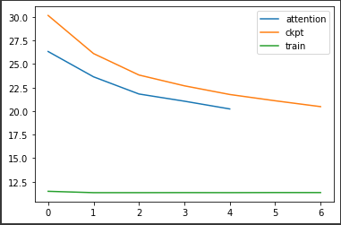
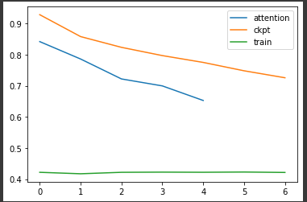

# Video Frame Prediction
This repo contains my trials to predicting future frames of a video given the past.

Modified Pix2Pix to be able to take in multiple frames as input and output multiple frames.

Tried replacing a few layers of the MotionContent decomposed GAN with Self Attention.

## Here are the results : 

The models are trained to take in 10 input frames and output 7 frames.

Legend:
 - X-Axis : Denotes the output frame number (0 based index).
 - Y-Axes : Denotes PSNR or SSIM values vs the ground truth
 - Attention (Blue): Replacing 1 Convolution layer with Self attention, trained from scratch for 10k epochs.
 - ckpt (orange) : Checkpoint provided by authors of MotionContentGAN (100k epochs).
 - train (green) : Training the Network from scratch, for 20k epochs.

Average PSNR (compared to ground truth) of test samples from UCF-101 dataset.

Average SSIM (compared to ground truth) of test samples from UCF-101 dataset.

As you can see, replacing one convolution layer by self attention layer, significantly reduces the training time. We can achieve similar PSNR and SSIM values ie not much deviation compared to that trained for 5x longer and much better results compared to that trained 2x longer.

The model trained from scratch performed poorly with PSNR hovering around 12 while the other two methods are in high 20s.

The Structural Similarity Index (SSIM) tells us that the generated images are pretty similar to the ground truths and tapers off a little to the end, which is expected as the errors/artifacts accumulated in the previous frames(steps) also influence the current frame.